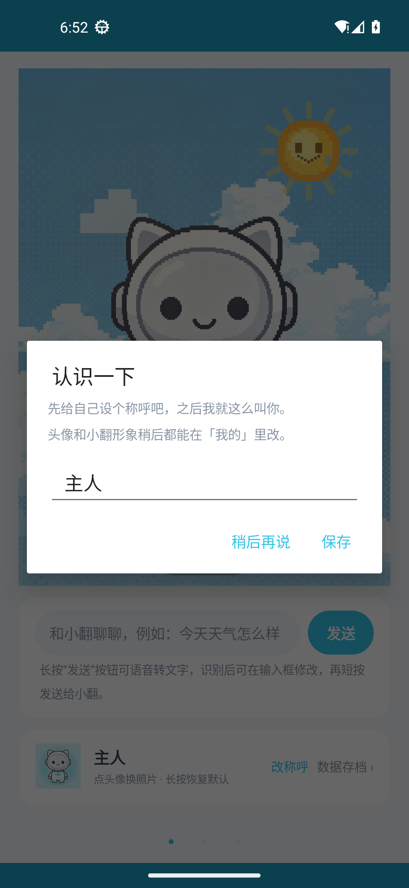
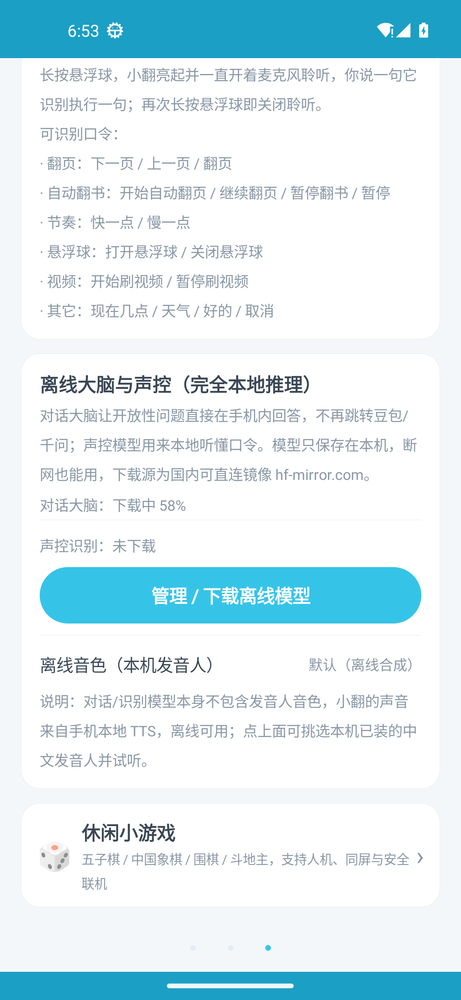
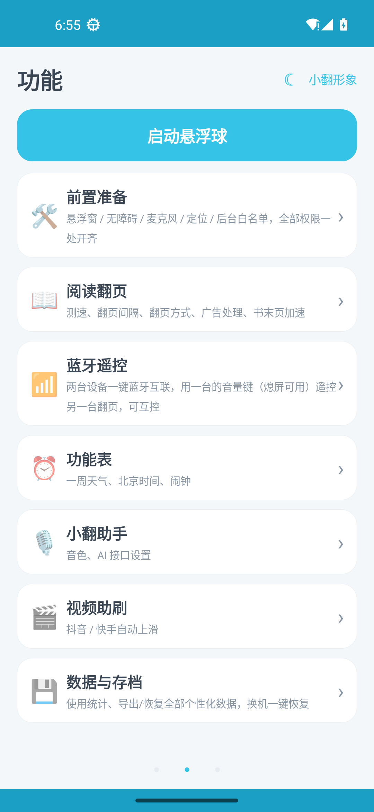

# 小翻 (XiaoFan) v2.1

<p align="center">
  
  
</p>

## 项目简介

小翻是一款 Android 应用，包名为 `com.xiaofan.bangfan`，版本 2.1。

本仓库为 APK 反编译后的源代码，用于学习和研究目的。

## 应用信息

- **包名**: `com.xiaofan.bangfan`
- **版本号**: 2.1 (versionCode: 3)
- **最低 SDK**: Android 7.0 (API 24)
- **目标 SDK**: Android 14 (API 34)
- **编译 SDK**: Android 14 (API 34)

## 应用图标

| 方形图标 | 圆形图标 |
|---------|---------|
|  |  |

## 应用截图

| 欢迎引导页 | AI 助手主页 |
|-----------|------------|
|  |  |

| 离线声控设置 | 离线 AI 大脑 |
|------------|-------------|
|  |  |

| 功能列表 |
|---------|
|  |

## 主要权限

- 相机 (CAMERA)
- 录音 (RECORD_AUDIO)
- 悬浮窗 (SYSTEM_ALERT_WINDOW)
- 前台服务 (FOREGROUND_SERVICE)
- 网络访问 (INTERNET)
- 蓝牙 (BLUETOOTH)
- 定位 (ACCESS_FINE_LOCATION)
- 通知 (POST_NOTIFICATIONS)

## 目录结构

```
xiaofan-source/
├── sources/          # Java 源代码（反编译）
│   ├── android/
│   ├── androidx/
│   ├── com/          # 应用主代码及第三方库
│   ├── kotlin/
│   ├── okhttp3/
│   └── ...
└── resources/        # 资源文件
    ├── AndroidManifest.xml
    ├── res/
    └── assets/
```

## 反编译说明

本代码由 [jadx](https://github.com/skylot/jadx) v1.4.7 从 APK 文件反编译生成。

注意事项：
- 反编译代码可能包含部分错误或无法编译的类
- 变量名和方法名可能被混淆
- 第三方库代码包含在 sources 目录中
- 原始资源文件已完整提取

## 构建

由于这是反编译代码，可能无法直接编译构建。建议使用 Android Studio 进行代码分析和学习。

## 许可证

本项目仅用于学习研究目的。原始应用版权归原作者所有。
